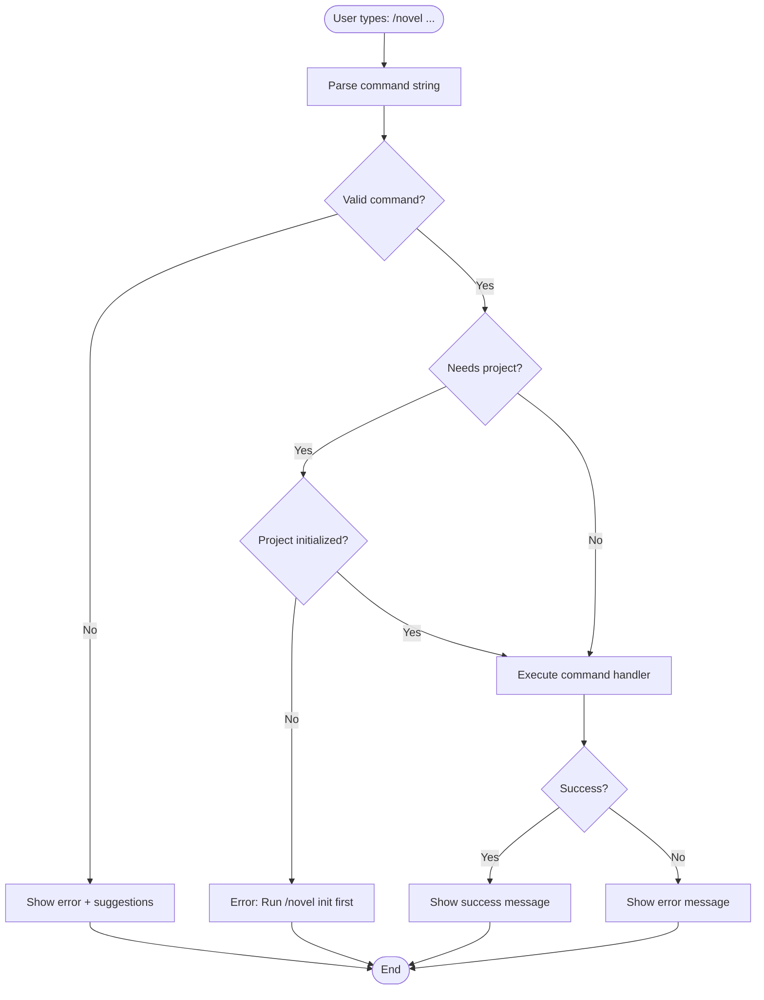

# CLI Command Parser Design

This document specifies the command-line interface for the Novel Writer extension, activated via the `/novel` slash command in Claude Code.

## Command Structure

```
/novel <command> [subcommand] [arguments] [--flags]
```

## Command Tree

```
/novel
├── init [--title] [--author] [--genre] [--words] [--phase]
├── create
│   ├── character [--interactive | --name --role ...]
│   ├── location [--interactive | --name --type ...]
│   └── chapter [--number] [--title] [--pov]
├── sync
│   ├── all
│   ├── characters
│   ├── locations
│   └── chapters
├── check
│   ├── consistency [--verbose]
│   ├── characters [--verbose]
│   ├── timeline [--verbose]
│   ├── world-rules [--verbose]
│   ├── plot-threads [--verbose]
│   ├── list [--severity]
│   ├── resolve --id <number> [--notes]
│   ├── acknowledge --id <number> [--notes]
│   └── false-positive --id <number> [--notes]
├── timeline
│   ├── add --name <string> [--type] [--timestamp] [--date] [--importance] [--before]
│   ├── list [--type] [--min-importance] [--backstory]
│   ├── show --name <string>
│   ├── update --name <string> [--timestamp] [--description] [--importance]
│   ├── delete --name <string>
│   ├── link --before <string> --after <string> [--type] [--notes]
│   ├── check
│   ├── sync
│   └── export [--output]
├── world-rule
│   ├── create --name <string> --category <string> --description <string>
│   ├── list [--category]
│   ├── show --name <string>
│   ├── add-example --name <string> --example <string>
│   ├── add-exception --name <string> --exception <string>
│   ├── limitations --name <string> --limitations <string>
│   ├── established --name <string> [--chapter] [--scene] [--quote]
│   ├── toggle-hard --name <string>
│   ├── sync [--name <string> | --all]
│   ├── stats
│   └── search --keyword <string>
├── list
│   ├── characters [--role]
│   ├── locations [--type]
│   ├── chapters
│   └── issues [--severity]
├── show
│   ├── character <name>
│   ├── location <name>
│   ├── chapter <number>
│   └── stats
├── export
│   ├── manuscript [--output] [--title] [--author] [--chapters] [--status]
│   └── stats [--chapters] [--status]
├── analyze
│   ├── pacing
│   ├── wordcount
│   └── progress
└── help [command]
```

## Detailed Command Specifications

### 1. `/novel init` - Initialize Project

**Purpose**: Create a new novel project in the current directory

**Syntax**:
```bash
/novel init
/novel init --title "My Novel" --author "Jane Smith" --genre "Sci-Fi" --words 120000 --phase planning
```

**Arguments**: None (prompts interactively)

**Flags**:
- `--title <string>` - Project title (default: prompts)
- `--author <string>` - Author name (default: prompts)
- `--genre <string>` - Genre/category (default: "")
- `--words <number>` - Target word count (default: 80000)
- `--phase <phase>` - Starting phase (default: "ideation")
  - Valid: `ideation`, `planning`, `drafting`, `revising`, `polishing`, `production`, `distribution`
- `--skip-prompts` - Non-interactive mode (requires all flags)

**Behavior**:
1. Check if directory is empty or already initialized
2. If no flags provided, prompt for required fields
3. Copy template structure from `novel/`
4. Initialize database with schema
5. Create project record
6. Optionally run character/location builders
7. Display success message and next steps

**Output**:
```
✨ Novel project initialized successfully!

Project: Galaxy at War
Author: Jane Smith
Genre: Sci-Fi
Target: 120000 words
Phase: planning

Directory structure created:
  📁 .novel/          - Extension metadata and database
  📁 characters/      - Character profiles (YAML)
  📁 locations/       - Locations and world elements (YAML)
  📁 chapters/        - Your manuscript chapters (Markdown)
  📁 research/        - Research materials
  📁 revisions/       - Previous draft versions
  📁 export/          - Generated manuscripts

Next steps:
  1. Customize style guides
  2. Create your first character: /novel create character
  3. Create key locations: /novel create location
  4. Start writing: /novel create chapter
```

**Errors**:
- `Already initialized` - .novel/ directory exists
- `Permission denied` - Cannot create directories
- `Invalid phase` - Phase not in valid list

---

### 2. `/novel create character` - Create Character

**Purpose**: Create a new character profile

**Syntax**:
```bash
/novel create character                    # Interactive mode (default)
/novel create character --interactive      # Explicit interactive
/novel create character --name "Sarah Chen" --role protagonist --summary "A brilliant astrophysicist..."
```

**Arguments**: None (interactive mode) or all required fields

**Flags**:

**Interactive mode** (default):
- `--interactive` - Explicit interactive mode (default behavior)

**Non-interactive mode** (requires all of):
- `--name <string>` - Character name (required)
- `--role <role>` - Character role (required)
  - Valid: `protagonist`, `antagonist`, `major`, `minor`, `background`
- `--summary <string>` - Character summary (required)

**Optional** (both modes):
- `--full-name <string>` - Full/formal name
- `--age <string>` - Age
- `--eyes <string>` - Eye color
- `--hair <string>` - Hair color
- `--height <string>` - Height
- `--build <string>` - Body build

**Behavior**:
1. If no flags: Run interactive builder (existing code)
2. If `--name`, `--role`, `--summary`: Create from arguments
3. Generate YAML file in `characters/`
4. Sync to database
5. Display success message

**Output**:
```
✅ Character created: Sarah Chen

File: characters/sarah-chen.yml
Role: protagonist
Database: synced

View: /novel show character "Sarah Chen"
Edit: Open characters/sarah-chen.yml
```

**Errors**:
- `Project not initialized` - No .novel/ directory
- `Missing required field` - Name, role, or summary not provided
- `Invalid role` - Role not in valid list
- `Character already exists` - File already exists with same name

---

### 3. `/novel create location` - Create Location

**Purpose**: Create a new location/world element

**Syntax**:
```bash
/novel create location                     # Interactive mode
/novel create location --name "SETI Observatory" --type building --description "A remote facility..."
```

**Arguments**: None (interactive mode) or all required fields

**Flags**:

**Interactive mode**:
- `--interactive` - Interactive mode (default)

**Non-interactive mode** (requires all of):
- `--name <string>` - Location name (required)
- `--description <string>` - Location description (required)

**Optional**:
- `--type <string>` - Location type (city, building, room, planet, etc.)
- `--parent <string>` - Parent location name

**Behavior**:
1. If no flags: Run interactive builder
2. If required flags: Create from arguments
3. Generate YAML file in `locations/`
4. Sync to database
5. Display success message

**Output**:
```
✅ Location created: SETI Observatory

File: locations/seti-observatory.yml
Type: building
Database: synced

View: /novel show location "SETI Observatory"
Edit: Open locations/seti-observatory.yml
```

---

### 4. `/novel create chapter` - Create Chapter

**Purpose**: Create a new chapter file

**Syntax**:
```bash
/novel create chapter                      # Prompts for details
/novel create chapter --number 1 --title "The Signal" --pov sarah
/novel create chapter --number 5 --scenes 3
```

**Arguments**: None (prompts interactively)

**Flags**:
- `--number <number>` - Chapter number (default: next available)
- `--title <string>` - Chapter title (default: prompts)
- `--pov <character>` - POV character name (optional)
- `--location <location>` - Default location (optional)
- `--scenes <number>` - Number of scenes to create (default: 1)

**Behavior**:
1. Determine chapter number (from flag or next available)
2. Prompt for title if not provided
3. Create markdown file with YAML frontmatter
4. Add scene placeholders if `--scenes` > 1
5. Sync to database

**Output**:
```
✅ Chapter created: Chapter 5 - Breaking Point

File: chapters/05-breaking-point.md
POV: Sarah Chen
Scenes: 3

Open file to start writing!
```

---

### 5. `/novel sync` - Synchronize Files

**Purpose**: Sync files to database

**Syntax**:
```bash
/novel sync                                # Sync all files
/novel sync all                           # Explicit all
/novel sync characters                    # Only characters
/novel sync locations                     # Only locations
/novel sync chapters                      # Only chapters
```

**Subcommands**:
- `all` - Sync all file types (default)
- `characters` - Sync only character YAML files
- `locations` - Sync only location YAML files
- `chapters` - Sync only chapter markdown files

**Behavior**:
1. Scan specified directory/directories
2. Parse each file (YAML or Markdown)
3. Upsert to database
4. Report results

**Output**:
```
Syncing files to database...

Characters:
  ✓ sarah-chen.yml
  ✓ marcus-blake.yml
  ✓ elena-rodriguez.yml

Locations:
  ✓ seti-observatory.yml
  ✓ marcus-apartment.yml

Chapters:
  ✓ 01-the-signal.md
  ✓ 02-first-contact.md

✅ Synced 8 files successfully
```

---

### 6. `/novel check` - Consistency Checking

**Purpose**: Check manuscript for contradictions and inconsistencies across characters, timeline, world rules, and plot threads

#### 6.1. `/novel check consistency` - Run All Checks

**Syntax**:
```bash
/novel check consistency                  # Run all consistency checks
/novel check consistency --verbose        # Show detailed information
/novel check                              # Shorthand for consistency
```

**Flags**:
- `--verbose` / `-v` - Show detailed information (chapter IDs, scene IDs, detection dates)

**Behavior**:
1. Runs all four check types (character, timeline, world-rules, plot-threads)
2. Groups issues by severity (❌ errors, ⚠️  warnings, ℹ️ info)
3. Displays formatted output with issue counts
4. Returns summary statistics

**Output**:
```
Running consistency checks...

❌ Critical Issues (2):

❌ #1 [character_attribute]
  Character attribute conflict: Sarah has blue eyes in Chapter 3 but brown eyes in Chapter 15

❌ #2 [timeline]
  Timeline conflict: Event A (May 5) occurs after Event B (May 1) but is referenced before it

⚠️  Warnings (1):

⚠️  #3 [world_rule]
  Magic system rule violated: spell cast without verbal component in Chapter 12

Total issues found: 3
  Errors: 2
  Warnings: 1
  Info: 0
```

#### 6.2. `/novel check characters` - Character Consistency

**Purpose**: Check character attribute consistency (physical descriptions, ages, relationships)

**Syntax**:
```bash
/novel check characters
/novel check characters --verbose
```

**Output**:
```
Checking character consistency...

✓ No character consistency issues found!
```

#### 6.3. `/novel check timeline` - Timeline Consistency

**Purpose**: Check chronological consistency of events and dates

**Syntax**:
```bash
/novel check timeline
/novel check timeline --verbose
```

**Output**:
```
Checking timeline consistency...

⚠️  #1 [timeline]
  Event occurs before it is possible: Marcus references meeting on May 5th in Chapter 3,
  but meeting happens in Chapter 8

Found 1 timeline consistency issue(s)
```

#### 6.4. `/novel check world-rules` - World Rules

**Purpose**: Check for violations of established world rules (magic systems, technology, physics)

**Syntax**:
```bash
/novel check world-rules
/novel check world-rules --verbose
```

#### 6.5. `/novel check plot-threads` - Plot Thread Status

**Purpose**: Check for unresolved or abandoned plot threads

**Syntax**:
```bash
/novel check plot-threads
/novel check plot-threads --verbose
```

#### 6.6. `/novel check list` - List Issues

**Purpose**: List existing consistency issues with optional severity filtering

**Syntax**:
```bash
/novel check list                         # All open issues
/novel check list --severity error        # Only errors
/novel check list --severity warning      # Only warnings
/novel check list --severity info         # Only info
/novel check list --verbose               # With detailed information
```

**Flags**:
- `--severity` / `-s` - Filter by severity (error, warning, info)
- `--verbose` / `-v` - Show detailed information

**Output**:
```
=== Open Consistency Issues ===

❌ #1 [character_attribute]
  Sarah's eye color changes from blue to brown

❌ #2 [timeline]
  Event sequence contradiction detected

⚠️  #3 [world_rule]
  Magic system rule violated in Chapter 12

Total: 3 issue(s)
Use /novel check resolve --id <id> to mark as resolved
Use /novel check acknowledge --id <id> to acknowledge intentional inconsistency
```

#### 6.7. `/novel check resolve` - Resolve Issue

**Purpose**: Mark a consistency issue as resolved (fixed in manuscript)

**Syntax**:
```bash
/novel check resolve --id 5
/novel check resolve --id 5 --notes "Fixed eye color throughout"
```

**Flags**:
- `--id` / `-i` - Issue ID (required)
- `--notes` / `-n` - Resolution notes (optional)

**Output**:
```
Issue #5 marked as resolved
Notes: Fixed eye color throughout
```

#### 6.8. `/novel check acknowledge` - Acknowledge Issue

**Purpose**: Acknowledge an intentional inconsistency (will not be flagged again)

**Syntax**:
```bash
/novel check acknowledge --id 3
/novel check acknowledge --id 3 --notes "Intentional for narrative effect"
```

**Flags**:
- `--id` / `-i` - Issue ID (required)
- `--notes` / `-n` - Acknowledgment notes (optional)

**Output**:
```
Issue #3 acknowledged
This issue is intentional and will not be flagged again
Notes: Intentional for narrative effect
```

#### 6.9. `/novel check false-positive` - Mark False Positive

**Purpose**: Mark an issue as incorrectly detected (false positive)

**Syntax**:
```bash
/novel check false-positive --id 7
/novel check false-positive --id 7 --notes "Not actually a contradiction"
```

**Flags**:
- `--id` / `-i` - Issue ID (required)
- `--notes` / `-n` - Notes explaining why it's a false positive (optional)

**Output**:
```
Issue #7 marked as false positive
Notes: Not actually a contradiction
```

---

### 7. `/novel list` - List Elements

**Purpose**: List characters, locations, chapters, or issues

**Syntax**:
```bash
/novel list characters                    # All characters
/novel list characters --role protagonist # Filter by role
/novel list locations --type building     # Filter by type
/novel list chapters                      # All chapters
/novel list issues --severity error       # Only errors
```

**Subcommands**:
- `characters` - List all characters
- `locations` - List all locations
- `chapters` - List all chapters
- `issues` - List consistency issues

**Flags**:
- `--role <role>` - Filter characters by role
- `--type <type>` - Filter locations by type
- `--severity <level>` - Filter issues by severity (error, warning, info)
- `--status <status>` - Filter issues by status (open, fixed, ignored)

**Output**:
```
📚 Characters (5)

Protagonists:
  • Sarah Chen (scientist, 23 appearances)
  • Marcus Blake (detective, 18 appearances)

Antagonists:
  • Dr. Vance (director, 12 appearances)

Major Supporting:
  • Elena Rodriguez (journalist, 15 appearances)
  • James Park (engineer, 8 appearances)

Use '/novel show character <name>' for details
```

---

### 8. `/novel show` - Show Details

**Purpose**: Display detailed information about an element

**Syntax**:
```bash
/novel show character "Sarah Chen"        # Character details
/novel show location "SETI Observatory"   # Location details
/novel show chapter 5                     # Chapter details
/novel show stats                         # Project statistics
```

**Subcommands**:
- `character <name>` - Character profile and statistics
- `location <name>` - Location details and appearances
- `chapter <number>` - Chapter metadata and word count
- `stats` - Overall project statistics

**Output** (character):
```
👤 Sarah Chen

Role: Protagonist
Summary: A brilliant but isolated astrophysicist who discovers
         an anomaly that challenges everything she knows.

Physical:
  Age: 34
  Eyes: Blue
  Hair: Dark brown
  Height: 5'7"

Personality:
  Core: Analytical and driven
  Strengths: Exceptional problem-solver
  Flaws: Struggles to trust others
  Fears: Being wrong, losing control

Appearances: 23 scenes
First seen: Chapter 1
Last seen: Chapter 18

Relationships:
  • Marcus Blake (colleagues, complicated)
  • Dr. Vance (conflict, authority)
  • Elena Rodriguez (friends, supportive)

Character Arc:
  Starting: Isolated and mistrustful
  Midpoint: Forced to choose between career and right thing
  Ending: Learns to work with team, reconnects with humanity

File: characters/sarah-chen.yml
```

**Output** (stats):
```
📊 Project Statistics

Project: Galaxy at War
Author: Jane Smith
Phase: Drafting

Progress:
  Chapters: 18 / 30 planned (60%)
  Word count: 45,230 / 120,000 (38%)
  Scenes: 67

Characters:
  Total: 15
  POV characters: 3
  Protagonists: 2
  Antagonists: 1

Locations: 12 unique locations

Timeline:
  Story duration: 47 days
  Time covered: May 1 - June 17, 2045

Writing Streak: 12 days
Daily average: 1,250 words
Sessions: 34

Last updated: 2 hours ago
```

---

### 9. `/novel export` - Export Manuscript

**Purpose**: Export novel in various formats

**Syntax**:
```bash
/novel export manuscript                  # Interactive format selection
/novel export manuscript --format pdf     # Export to PDF
/novel export manuscript --format docx --output "Draft-v2.docx"
/novel export outline --format md         # Export outline only
```

**Subcommands**:
- `manuscript` - Export complete manuscript
- `outline` - Export outline/structure only

**Flags**:
- `--format <format>` - Output format (default: prompts)
  - Valid: `markdown`, `docx`, `pdf`, `epub`, `html`
- `--output <filename>` - Output filename (default: auto-generated)
- `--chapters <range>` - Chapter range (e.g., "1-10", "5,7,9-12")
- `--include-notes` - Include author notes/comments
- `--single-file` - Combine all chapters into one file

**Behavior**:
1. Validate format and options
2. Gather chapter content from database
3. Apply formatting for target format
4. Generate file in `export/` directory
5. Display success with file path

**Output**:
```
📤 Exporting manuscript...

Format: PDF
Chapters: All (18 chapters)
Word count: 45,230

Generating...
✓ Formatting chapters
✓ Adding title page
✓ Building table of contents
✓ Applying styles
✓ Creating PDF

✅ Export complete!

File: export/galaxy-at-war-draft-2025-10-25.pdf
Size: 1.2 MB

Open: /novel open export/galaxy-at-war-draft-2025-10-25.pdf
```

---

### 10. `/novel analyze` - Analyze Manuscript

**Purpose**: Analyze pacing, word count, and progress

**Syntax**:
```bash
/novel analyze pacing                     # Pacing analysis
/novel analyze wordcount                  # Word count breakdown
/novel analyze progress                   # Progress tracking
```

**Subcommands**:
- `pacing` - Scene pacing and chapter rhythm analysis
- `wordcount` - Word count by chapter/scene/character
- `progress` - Progress over time with projections

**Output** (pacing):
```
📈 Pacing Analysis

Chapter Lengths (words):
  Ch 1-5:   Avg 2,500 (Good variation)
  Ch 6-10:  Avg 2,200 (Consistent)
  Ch 11-15: Avg 3,100 (Getting longer ⚠️)
  Ch 16-18: Avg 2,400 (Back on track)

Scene Lengths:
  Shortest: 800 words (Ch 3, Scene 2)
  Longest: 4,200 words (Ch 13, Scene 1) ⚠️
  Average: 1,850 words

Recommendations:
  • Consider splitting Ch 13 Scene 1 (too long)
  • Ch 11-15 are getting lengthy - check pacing
  • Good variety in earlier chapters

Action vs Reflection:
  Action scenes: 35% (avg 1,500 words)
  Dialogue scenes: 40% (avg 1,800 words)
  Reflection: 25% (avg 2,200 words)
```

---

### 11. `/novel timeline` - Timeline Management

**Purpose**: Manage timeline events and chronology for your story

#### 11.1. `/novel timeline add` - Add Timeline Event

**Syntax**:
```bash
/novel timeline add --name "Hero discovers artifact"
/novel timeline add --name "Opening scene" --type plot --timestamp 1000 --importance 9
/novel timeline add --name "Hero's past trauma" --type backstory --date "10 years before story" --before "Hero faces challenge"
```

**Flags**:
- `--name` / `-n` - Event name (required)
- `--type` / `-t` - Event type: plot, backstory, world_history (optional)
- `--description` / `-d` - Event description (optional)
- `--timestamp` / `-ts` - Story timestamp for precise ordering (number) (optional)
- `--date` - Story date for human-readable reference (string) (optional)
- `--importance` / `-i` - Importance 1-10 (optional)
- `--backstory` / `-b` - Mark as backstory event (boolean) (optional)
- `--before` - Comma-separated list of event names this happens before (optional)

**Output**:
```
✅ Created timeline event: Hero discovers artifact (ID: 5)

Dependencies created:
  • Hero discovers artifact → Hero gains power
  • Hero discovers artifact → Final confrontation
```

#### 11.2. `/novel timeline list` - List Timeline Events

**Syntax**:
```bash
/novel timeline list                              # All events, ordered by timestamp
/novel timeline list --type plot                  # Only plot events
/novel timeline list --min-importance 8           # High importance events
/novel timeline list --backstory                  # Only backstory events
```

**Flags**:
- `--type` / `-t` - Filter by event type (plot, backstory, world_history)
- `--min-importance` / `-i` - Minimum importance level (1-10)
- `--backstory` / `-b` - Show only backstory events (boolean)

**Output**:
```
📅 Timeline Events (12 total)

Plot Events (10):
  [ts: 100] Hero discovers quest (⭐️ 9)
  [ts: 200] Hero meets mentor (⭐️ 8)
  [ts: 300] Hero gains power (⭐️ 10)
  [ts: 500] Midpoint twist (⭐️ 9)
  ...

Backstory Events (2):
  Hero's childhood trauma (⭐️ 8) - 10 years before story
  Kingdom established (⭐️ 7) - 100 years before story

Use '/novel timeline show --name <name>' for details
```

#### 11.3. `/novel timeline show` - Show Event Details

**Syntax**:
```bash
/novel timeline show --name "Hero discovers artifact"
```

**Flags**:
- `--name` / `-n` - Event name (required)

**Output**:
```
📅 Hero discovers artifact

Type: plot
Description: The protagonist finds the ancient artifact in the ruins
Story Date: Day 3 of the journey
Timestamp: 1000
Importance: ⭐️⭐️⭐️⭐️⭐️⭐️⭐️⭐️⭐️ (9/10)
Backstory: No

Dependencies:
  This event must happen BEFORE:
    • Hero gains power (causation: artifact unlocks abilities)

  This event must happen AFTER:
    • Hero begins journey (sequence)
```

#### 11.4. `/novel timeline update` - Update Timeline Event

**Syntax**:
```bash
/novel timeline update --name "Hero discovers artifact" --timestamp 1500
/novel timeline update --name "Opening scene" --description "Updated description" --importance 8
```

**Flags**:
- `--name` / `-n` - Event name (required)
- `--timestamp` / `-ts` - New timestamp (optional)
- `--description` / `-d` - New description (optional)
- `--date` - New story date (optional)
- `--importance` / `-i` - New importance (1-10) (optional)

**Output**:
```
✅ Updated timeline event: Hero discovers artifact
  Timestamp: 1000 → 1500
```

#### 11.5. `/novel timeline delete` - Delete Timeline Event

**Syntax**:
```bash
/novel timeline delete --name "Unused event"
```

**Flags**:
- `--name` / `-n` - Event name (required)

**Output**:
```
⚠️  Deleting timeline event: Unused event
  This will also delete 2 dependency relationships

Confirm deletion? (y/n): y

✅ Deleted timeline event: Unused event
```

#### 11.6. `/novel timeline link` - Create Event Dependency

**Syntax**:
```bash
/novel timeline link --before "Hero discovers artifact" --after "Hero gains power"
/novel timeline link --before "Event A" --after "Event B" --type causation --notes "A causes B"
```

**Flags**:
- `--before` / `-b` - Event that must happen first (required)
- `--after` / `-a` - Event that must happen second (required)
- `--type` / `-t` - Dependency type: sequence, causation, reference (default: sequence)
- `--notes` / `-n` - Notes about the dependency (optional)

**Dependency Types**:
- `sequence` - Simple chronological order (A then B)
- `causation` - A directly causes B
- `reference` - B references/recalls A

**Output**:
```
✅ Created timeline dependency:
  Hero discovers artifact → Hero gains power (causation)
  Notes: Artifact unlocks the hero's latent abilities
```

#### 11.7. `/novel timeline check` - Check Timeline Conflicts

**Syntax**:
```bash
/novel timeline check
```

**Behavior**:
Detects timeline conflicts where dependencies contradict timestamps:
- Event A must happen before Event B (dependency)
- But timestamp of A > timestamp of B (conflict!)

**Output** (with conflicts):
```
⚠️  Timeline Conflicts Detected (2)

❌ Conflict #1:
  "Hero discovers artifact" (timestamp: 300)
  must happen BEFORE
  "Hero meets mentor" (timestamp: 100)
  but timestamps are reversed!

❌ Conflict #2:
  "Midpoint reveal" (timestamp: 2000)
  must happen BEFORE
  "Opening scene" (timestamp: 500)
  but timestamps are reversed!

Fix these conflicts by updating event timestamps with:
  /novel timeline update --name "Event" --timestamp <new_value>
```

**Output** (no conflicts):
```
✅ No timeline conflicts detected!
All event dependencies match their timestamps.
```

#### 11.8. `/novel timeline sync` - Sync Timeline Files

**Syntax**:
```bash
/novel timeline sync
```

**Behavior**:
Syncs all YAML files in `timeline/` directory to database:
1. Scans `timeline/` for `*.yaml` and `*.yml` files
2. Parses event data and `happensBefore` dependencies
3. Upserts events to database
4. Creates dependency relationships
5. Reports results

**Output**:
```
Syncing timeline files...

✓ timeline/act1.yaml (2 events)
✓ timeline/act2.yaml (1 event)
✓ timeline/backstory.yaml (3 events)

✅ Synced 3 files, 6 events total
  Created 4 dependency relationships
```

#### 11.9. `/novel timeline export` - Export Timeline to YAML

**Syntax**:
```bash
/novel timeline export                            # Exports to timeline/timeline.yaml
/novel timeline export --output timeline/act1.yaml
```

**Flags**:
- `--output` / `-o` - Output file path (default: timeline/timeline.yaml)

**Behavior**:
Exports all timeline events from database to YAML format with `happensBefore` dependencies.

**Output**:
```
Exporting timeline to YAML...

✅ Exported 12 events to timeline/timeline.yaml

File format:
  events:
    - name: Event name
      type: plot
      description: Event description
      storyTimestamp: 1000
      importance: 9
      happensBefore:
        - Dependent event 1
        - Dependent event 2
```

**Generated YAML**:
```yaml
events:
  - name: Hero discovers artifact
    type: plot
    description: The protagonist finds the ancient artifact
    storyDate: Day 3 of the journey
    storyTimestamp: 1000
    importance: 9
    happensBefore:
      - Hero gains power
      - Final confrontation

  - name: Hero gains power
    type: plot
    description: Artifact unlocks abilities
    storyTimestamp: 2000
    importance: 10
    happensBefore: []
```

---

### 12. `/novel world-rule` - World Rules Management

**Purpose**: Manage world-building rules and consistency constraints

World rules help maintain consistency in your fictional world by documenting the fundamental rules that govern your story's universe (magic systems, technology levels, physical laws, social structures, political systems, etc.).

---

#### 12.1. `/novel world-rule create` - Create World Rule

**Purpose**: Create a new world rule

**Syntax**:
```bash
/novel world-rule create --name "Elemental Magic" --category magic --description "Mages can control the four classical elements"
/novel world-rule create --name "Teleportation" --category magic --description "Instant travel between locations" --limitations "Requires line of sight" --hard-rule
```

**Required Flags**:
- `--name, -n <string>` - Rule name
- `--category, -c <string>` - Rule category: `magic`, `technology`, `physics`, `social`, `political`
- `--description, -d <string>` - What the rule establishes

**Optional Flags**:
- `--limitations, -l <string>` - Constraints or limitations on this rule
- `--hard-rule <boolean>` - Whether rule must NEVER be violated (default: true)

**Behavior**:
1. Validates category is one of the five allowed types
2. Creates YAML file in `world-rules/` directory
3. Syncs to database if initialized
4. Returns file path

**Output**:
```
✅ World rule created: C:\project\world-rules\elemental-magic.yml
ℹ Name: Elemental Magic
ℹ Category: magic
ℹ Hard Rule: true
✅ Synced to database
```

---

#### 12.2. `/novel world-rule list` - List World Rules

**Purpose**: List all world rules, optionally filtered by category

**Syntax**:
```bash
/novel world-rule list
/novel world-rule list --category magic
```

**Optional Flags**:
- `--category, -c <string>` - Filter by category

**Output**:
```
✅ Found 3 world rules:

🔒 ✨ Elemental Magic
  Category: magic
  Mages can control the four classical elements

🔓 ⚙️ Steam Engines
  Category: technology
  Technology is based on steam power
  Limitations: Limited by coal availability...

🔒 🏛️ Monarchy
  Category: political
  Kingdom ruled by hereditary monarchs
```

**Legend**:
- 🔒 = Hard rule (must never violate)
- 🔓 = Flexible rule (guidelines, can bend)
- ✨ = magic | ⚙️ = technology | 🔬 = physics | 👥 = social | 🏛️ = political

---

#### 12.3. `/novel world-rule show` - Show Rule Details

**Purpose**: Display detailed information about a specific rule

**Syntax**:
```bash
/novel world-rule show --name "Elemental Magic"
```

**Required Flags**:
- `--name, -n <string>` - Rule name (case-insensitive)

**Output**:
```
✅ World Rule: Elemental Magic

ℹ Category: ✨ magic
ℹ Hard Rule: 🔒 Yes (must never violate)

ℹ Description:
  Mages can control the four classical elements: fire, water, earth, and air

ℹ Limitations:
  Each mage can only master one element. Dual-element magic is impossible.

ℹ Examples (2):
  1. The wizard spoke "Ignis Flamma" and fire erupted from his staff
  2. She raised her hand and the earth trembled beneath their feet

ℹ Exceptions (1):
  1. The Avatar can control all four elements (unique case)

ℹ Established:
  Chapter: 2
  Scene: Ch2.S3
  Quote: "Magic comes from the elements themselves"
```

---

#### 12.4. `/novel world-rule add-example` - Add Example

**Purpose**: Add an example of the rule being applied in your story

**Syntax**:
```bash
/novel world-rule add-example --name "Elemental Magic" --example "The wizard conjured a wall of flame"
```

**Required Flags**:
- `--name, -n <string>` - Rule name
- `--example <string>` - Example text

**Behavior**:
- Appends to rule's `examples` array
- Syncs to database

---

#### 12.5. `/novel world-rule add-exception` - Add Exception

**Purpose**: Document exceptions or special cases for this rule

**Syntax**:
```bash
/novel world-rule add-exception --name "Magic System" --exception "Ancient artifacts can cast spells silently"
```

**Required Flags**:
- `--name, -n <string>` - Rule name
- `--exception <string>` - Exception description

**Behavior**:
- Appends to rule's `exceptions` array
- Useful for documenting when/how rules can be bent
- Syncs to database

---

#### 12.6. `/novel world-rule limitations` - Update Limitations

**Purpose**: Set or update the limitations/constraints on a rule

**Syntax**:
```bash
/novel world-rule limitations --name "Teleportation" --limitations "Requires line of sight to destination. Maximum range 100 meters."
```

**Required Flags**:
- `--name, -n <string>` - Rule name
- `--limitations, -l <string>` - Limitations text (replaces existing)

---

#### 12.7. `/novel world-rule established` - Mark Where Established

**Purpose**: Document where this rule was first established in your manuscript

**Syntax**:
```bash
/novel world-rule established --name "Magic System" --chapter 2 --scene "Ch2.S3" --quote "Magic always requires words of power"
```

**Required Flags**:
- `--name, -n <string>` - Rule name

**Optional Flags**:
- `--chapter <number>` - Chapter number
- `--scene <string>` - Scene identifier
- `--quote <string>` - Quote that establishes the rule

**Use Case**: Helps you reference back to where you first introduced each rule, useful for consistency checking.

---

#### 12.8. `/novel world-rule toggle-hard` - Toggle Hard Rule Status

**Purpose**: Toggle whether a rule is "hard" (must never violate) or "flexible" (guideline)

**Syntax**:
```bash
/novel world-rule toggle-hard --name "Magic System"
```

**Required Flags**:
- `--name, -n <string>` - Rule name

**Output**:
```
✅ Toggled hard rule status for: Magic System
ℹ Now: 🔓 Flexible rule
```

**Hard vs Flexible Rules**:
- **Hard Rule** (🔒): Must NEVER be violated. Breaking it creates a consistency error.
  - Example: "Time travel is impossible in this universe"
- **Flexible Rule** (🔓): Guideline that can be bent with good reason.
  - Example: "Most magic requires verbal spells" (allows for exceptions)

---

#### 12.9. `/novel world-rule sync` - Sync to Database

**Purpose**: Sync world rule YAML files to database

**Syntax**:
```bash
/novel world-rule sync --name "Magic System"     # Sync one rule
/novel world-rule sync --all                     # Sync all rules
```

**Flags**:
- `--name, -n <string>` - Sync single rule by name
- `--all, -a` - Sync all rules in world-rules/ directory

---

#### 12.10. `/novel world-rule stats` - Show Statistics

**Purpose**: Display statistics about your world rules

**Syntax**:
```bash
/novel world-rule stats
```

**Output**:
```
✅ World Rules Statistics:

ℹ Total Rules: 8
ℹ Hard Rules: 🔒 5
ℹ Flexible Rules: 🔓 3
ℹ Established: 6

ℹ By Category:
  ✨ magic: 3
  ⚙️ technology: 2
  🔬 physics: 1
  👥 social: 1
  🏛️ political: 1
```

---

#### 12.11. `/novel world-rule search` - Search Rules

**Purpose**: Search world rules by keyword

**Syntax**:
```bash
/novel world-rule search --keyword fire
/novel world-rule search --keyword "time travel"
```

**Required Flags**:
- `--keyword, -k <string>` - Search term (searches name and description)

**Output**:
```
✅ Found 2 rules matching: fire

🔒 ✨ Fire Magic
  Category: magic
  Control over flames and heat

🔓 ⚙️ Steam Engines
  Category: technology
  Powered by coal and fire
```

---

### World Rule YAML Format

World rules are stored as YAML files in `world-rules/` directory:

```yaml
name: Elemental Magic
category: magic
description: Mages can control the four classical elements
limitations: Each mage can only master one element
is_hard_rule: true
examples:
  - The wizard spoke "Ignis Flamma" and fire erupted from his staff
  - She raised her hand and the earth trembled beneath their feet
exceptions:
  - The Avatar can control all four elements (unique case)
established_in:
  chapter: 2
  scene: Ch2.S3
  quote: Magic comes from the elements themselves
notes: Central to the magic system
```

---

### 13. `/novel export` - Export Manuscript

**Purpose**: Export manuscript in various formats

The export system assembles all chapters into a single manuscript file. The output is clean markdown that can be converted to DOCX, EPUB, or PDF using **mcp-pandoc**.

---

#### 13.1. `/novel export manuscript` - Export Complete Manuscript

**Purpose**: Combine all chapters into a single manuscript file

**Syntax**:
```bash
/novel export manuscript
/novel export manuscript --output final-manuscript.md
/novel export manuscript --title "My Novel" --author "Jane Doe"
/novel export manuscript --chapters 1,2,3
/novel export manuscript --status final
/novel export manuscript --no-metadata --no-chapter-numbers
```

**Optional Flags**:
- `--output, -o <path>` - Output file path (default: `export/manuscript.md`)
- `--title, -t <string>` - Manuscript title (overrides database)
- `--author, -a <string>` - Author name (overrides database)
- `--genre, -g <string>` - Genre/category
- `--copyright <string>` - Copyright notice
- `--dedication <string>` - Dedication text
- `--acknowledgments <string>` - Acknowledgments section
- `--about <string>` - About the author section
- `--chapters <numbers>` - Comma-separated chapter numbers to include
- `--status <statuses>` - Filter by chapter status (drafted, revised, final)
- `--no-metadata` - Exclude title page and metadata
- `--no-front-matter` - Exclude dedication and acknowledgments
- `--no-chapter-numbers` - Remove chapter numbers from headings
- `--scene-break <string>` - Custom scene break marker (default: `* * *`)

**Behavior**:
1. Loads all chapter files from `chapters/` directory
2. Parses chapter frontmatter (title, number, status, POV)
3. Removes internal scene markers (`<!-- scene:1 -->`, etc.)
4. Builds title page with metadata
5. Assembles chapters in order
6. Adds front/back matter if requested
7. Exports to markdown file
8. Shows word count statistics

**Output**:
```
ℹ Assembling manuscript...
✅ Manuscript exported: C:\project\export\manuscript.md

ℹ Chapters: 15
ℹ Total words: 72,450
ℹ Average chapter: 4,830 words

💡 Tip: Use mcp-pandoc to convert to other formats:
   - DOCX: Ask Claude to convert using mcp-pandoc
   - EPUB: Ask Claude to convert using mcp-pandoc
   - PDF:  Ask Claude to convert using mcp-pandoc
```

**Example Manuscript Structure**:
```markdown
# My Epic Novel

*by Jane Doe*

*Science Fiction*

© 2025 Jane Doe


*For my family*


---

# Chapter 1: The Beginning

This is the first chapter.

* * *

Sarah looked out the window.

* * *

She found something amazing.

---

# Chapter 2: Rising Tension

The conflict begins...
```

---

#### 13.2. `/novel export stats` - Show Manuscript Statistics

**Purpose**: Display word count and chapter breakdown statistics

**Syntax**:
```bash
/novel export stats
/novel export stats --chapters 1,2,3
/novel export stats --status final
```

**Optional Flags**:
- `--chapters <numbers>` - Show stats for specific chapters only
- `--status <statuses>` - Filter by chapter status

**Output**:
```
✅ Manuscript Statistics

ℹ Total Chapters: 15
ℹ Total Words: 72,450
ℹ Total Characters: 398,234
ℹ Average Chapter Length: 4,830 words

ℹ Chapter Breakdown:
  Ch 1: The Beginning - 4,250 words
  Ch 2: Rising Action - 5,100 words
  Ch 3: First Crisis - 4,890 words
  ...
```

---

### Converting to Other Formats with mcp-pandoc

The export system outputs clean markdown ready for conversion. To convert to DOCX, EPUB, or PDF:

**Step 1**: Install mcp-pandoc (one-time setup)
```bash
pip install mcp-pandoc
brew install pandoc         # macOS
brew install texlive        # For PDF support
```

**Step 2**: Export your manuscript
```bash
/novel export manuscript --output manuscript.md
```

**Step 3**: Ask Claude to convert
```
Convert manuscript.md to DOCX using mcp-pandoc with:
- Standard manuscript formatting
- 12pt Courier font
- 1-inch margins
- Double spacing
```

**Supported Conversions**:
- **DOCX**: For agents, editors, or Microsoft Word
- **EPUB**: For e-readers (Kindle, Kobo, etc.)
- **PDF**: For print-ready or review copies
- **HTML**: For web publishing
- **LaTeX**: For academic or advanced typesetting

**Example Conversions**:

```
# Standard manuscript for agents
Convert to DOCX with 12pt Courier, double-spaced, 1" margins

# E-book for Kindle
Convert to EPUB with table of contents and chapter breaks

# Print-ready PDF
Convert to PDF with 6x9 trim size, professional typesetting

# Web version
Convert to HTML with responsive styling
```

---

### 14. `/novel help` - Show Help

**Purpose**: Display command help and usage

**Syntax**:
```bash
/novel help                               # General help
/novel help init                          # Help for 'init' command
/novel help create character              # Help for 'create character'
```

**Arguments**:
- `[command]` - Optional command name for specific help

**Output** (general):
```
📖 Novel Writer CLI - Help

Usage: /novel <command> [subcommand] [arguments] [--flags]

Available Commands:

Project Management:
  init                 Initialize a new novel project
  sync                 Synchronize files to database

Content Creation:
  create character     Create a new character profile
  create location      Create a new location/world element
  create chapter       Create a new chapter

Analysis & Checking:
  check consistency    Check for contradictions and errors
  check timeline       Check timeline consistency
  check threads        Check unresolved plot threads
  list                 List characters, locations, chapters, issues
  show                 Show details for specific element
  analyze              Analyze pacing, word count, progress

Export:
  export manuscript    Export novel in various formats
  export outline       Export story outline

Help:
  help [command]       Show help for a specific command

Examples:
  /novel init
  /novel create character
  /novel sync all
  /novel check consistency
  /novel export manuscript --format pdf

For detailed help on a command:
  /novel help <command>
```

---

## Parser Implementation

### Command Structure

```typescript
interface Command {
  name: string;
  description: string;
  aliases?: string[];
  subcommands?: Command[];
  flags?: Flag[];
  arguments?: Argument[];
  handler: CommandHandler;
  examples?: string[];
}

interface Flag {
  name: string;
  alias?: string;
  description: string;
  type: 'string' | 'number' | 'boolean';
  required?: boolean;
  default?: any;
  choices?: string[];
}

interface Argument {
  name: string;
  description: string;
  type: 'string' | 'number';
  required?: boolean;
  variadic?: boolean;  // Takes multiple values
}

type CommandHandler = (args: ParsedArgs) => Promise<void>;

interface ParsedArgs {
  command: string;
  subcommand?: string;
  arguments: Record<string, any>;
  flags: Record<string, any>;
  raw: string;
}
```

### Parser Flow



### Error Handling

**Types of errors**:
1. **Parse errors**: Invalid command syntax
2. **Validation errors**: Missing required arguments/flags
3. **Project errors**: Not initialized, wrong directory
4. **Execution errors**: Handler fails
5. **Database errors**: DB not accessible

**Error messages should**:
- Be clear and actionable
- Suggest corrections
- Show command help if applicable

---

## Integration Points

### With Existing Code

```typescript
// Character creation
import { CharacterBuilder } from './builders/character-builder';
import { NovelWriterExtension } from './index';

// Handler for: /novel create character
async function handleCreateCharacter(args: ParsedArgs) {
  const ext = new NovelWriterExtension(process.cwd());

  if (args.flags.interactive || !args.flags.name) {
    // Use existing interactive builder
    await ext.createCharacterInteractive(createCLIPrompt());
  } else {
    // Non-interactive mode
    const builder = ext.getCharacterBuilder();
    await builder.createFromObject({
      name: args.flags.name,
      role: args.flags.role,
      summary: args.flags.summary,
      // ... other fields from flags
    });
  }
}
```

### With MCP Server

Commands that query database should use MCP:

```typescript
// Handler for: /novel list characters
async function handleListCharacters(args: ParsedArgs) {
  const mcpClient = getMCPClient();

  let conditions = {};
  if (args.flags.role) {
    conditions.role = args.flags.role;
  }

  const characters = await mcpClient.read_records({
    table: 'characters',
    conditions,
    order_by: 'name'
  });

  displayCharacterList(characters);
}
```

---

## File Structure

```
src/
├── cli/
│   ├── index.ts                 # Main CLI entry point
│   ├── parser.ts                # Command parser
│   ├── commands/                # Command definitions
│   │   ├── init.ts
│   │   ├── create.ts
│   │   ├── sync.ts
│   │   ├── check.ts
│   │   ├── list.ts
│   │   ├── show.ts
│   │   ├── export.ts
│   │   ├── analyze.ts
│   │   └── help.ts
│   ├── handlers/                # Command handlers
│   │   ├── init-handler.ts
│   │   ├── create-handler.ts
│   │   ├── sync-handler.ts
│   │   └── ...
│   ├── prompts.ts               # CLI prompt utilities
│   ├── output.ts                # Output formatting
│   ├── validators.ts            # Input validation
│   └── errors.ts                # Error handling
```

---

## Next Steps

1. **Implement parser** - Core parsing logic
2. **Build command registry** - Command definitions
3. **Create handlers** - One per command
4. **Add output formatting** - Colors, tables, spinners
5. **Integrate with slash command** - Claude Code integration
6. **Add tests** - Unit tests for parser and handlers
7. **Documentation** - User-facing command reference

---

## Example Usage Flows

### Initialize and Create First Character

```bash
User: /novel init

Claude: I'll help you initialize a new novel project.

Project title: Galaxy at War
Author name: Jane Smith
Genre (optional): Space Opera
Target word count [80000]: 120000
Starting phase [ideation]: planning

✨ Initializing project...
✅ Project initialized successfully!

Create your first character? (y/n): y

User: y

Claude: Running character builder...

Character name: Sarah Chen
Role: protagonist
Summary: A brilliant astrophysicist who discovers an anomaly...
[... more prompts ...]

✅ Character created: Sarah Chen
```

### Check and Fix Consistency

```bash
User: /novel check consistency

Claude: Running consistency checks...

❌ Found 2 errors, 3 warnings

Would you like me to help fix these? (y/n): y

User: y

Claude: Let's fix these issues:

1. Character attribute conflict: Sarah's eye color
   Chapter 3: "blue eyes"
   Chapter 15: "brown eyes"

   Which is correct?
   a) Blue (keep Chapter 3)
   b) Brown (keep Chapter 15)
   c) View both contexts

User: c

Claude: [Shows both excerpts with context]

User: a

Claude: ✓ Fixed: Updated Chapter 15 to "blue eyes"

[Continues with other issues...]

✅ All issues resolved!
```

---

This design provides a comprehensive CLI that's:
- **Intuitive**: Clear command structure
- **Flexible**: Interactive and non-interactive modes
- **Helpful**: Built-in help and examples
- **Integrated**: Works with all existing features
- **Extensible**: Easy to add new commands
