# Novel Project Initialization Flowchart

This document describes the complete flow for initializing a new novel project with the Claude Novel Writer extension.

## Flowchart

```mermaid
flowchart TD
    Start([User runs: novel init]) --> CheckDir{Is directory<br/>empty or new?}

    CheckDir -->|No - has files| AskOverwrite{Ask: Directory not empty.<br/>Initialize here anyway?}
    AskOverwrite -->|No| CancelInit([❌ Initialization cancelled])
    AskOverwrite -->|Yes| CheckExisting

    CheckDir -->|Yes - empty/new| CheckExisting{Check for existing<br/>.novel/ directory}

    CheckExisting -->|Exists| AlreadyInit([❌ Error: Project already<br/>initialized in this directory])
    CheckExisting -->|Not exists| CopyTemplate[Copy template structure from<br/>claudenovel_plugin/novel/]

    CopyTemplate --> TemplateSuccess{Template<br/>copied?}
    TemplateSuccess -->|Failed| CopyError([❌ Error: Failed to copy<br/>template structure])
    TemplateSuccess -->|Success| PromptMetadata[📝 Prompt for project metadata]

    PromptMetadata --> GetTitle[Get: Project Title<br/>required]
    GetTitle --> GetAuthor[Get: Author Name<br/>required]
    GetAuthor --> GetGenre[Get: Genre<br/>optional]
    GetGenre --> GetTarget[Get: Target Word Count<br/>optional, default: 80000]
    GetTarget --> GetPhase[Get: Starting Phase<br/>default: ideation]

    GetPhase --> InitDB[Initialize SQLite database<br/>using schema.sql]
    InitDB --> DBSuccess{Database<br/>initialized?}

    DBSuccess -->|Failed| DBError([❌ Error: Database<br/>initialization failed])
    DBSuccess -->|Success| CreateProject[Create project record in<br/>projects table]

    CreateProject --> SetProjectId[Store project_id for session]
    SetProjectId --> CreateDirs[Ensure all directories exist:<br/>characters/, locations/,<br/>chapters/, research/,<br/>revisions/, export/]

    CreateDirs --> ShowSuccess[✅ Show success message:<br/>Project initialized!]
    ShowSuccess --> ShowStructure[Display directory structure<br/>and explain purpose]

    ShowStructure --> PromptCustomize{Ask: Customize style<br/>guides now?}
    PromptCustomize -->|Yes| OpenStyleGuides[Open both style guides<br/>in editor with instructions]
    PromptCustomize -->|No| PromptFirstChar
    OpenStyleGuides --> PromptFirstChar

    PromptFirstChar{Ask: Create your<br/>first character?}
    PromptFirstChar -->|Yes| RunCharBuilder[Run interactive<br/>character builder]
    PromptFirstChar -->|No| PromptFirstLoc

    RunCharBuilder --> CharSuccess{Character<br/>created?}
    CharSuccess -->|Failed| CharError[⚠️ Warning: Character<br/>creation failed]
    CharSuccess -->|Success| CharSynced[✅ Character synced<br/>to database]
    CharError --> PromptFirstLoc
    CharSynced --> PromptFirstLoc

    PromptFirstLoc{Ask: Create your<br/>first location?}
    PromptFirstLoc -->|Yes| RunLocBuilder[Run interactive<br/>location builder]
    PromptFirstLoc -->|No| ShowNextSteps

    RunLocBuilder --> LocSuccess{Location<br/>created?}
    LocSuccess -->|Failed| LocError[⚠️ Warning: Location<br/>creation failed]
    LocSuccess -->|Success| LocSynced[✅ Location synced<br/>to database]
    LocError --> ShowNextSteps
    LocSynced --> ShowNextSteps

    ShowNextSteps[📋 Display next steps:<br/>1. Customize style guides<br/>2. Create characters<br/>3. Create locations<br/>4. Start writing]

    ShowNextSteps --> OfferCommands[Show available commands:<br/>/character, /world,<br/>/write, /check, etc.]

    OfferCommands --> Complete([✨ Initialization complete!<br/>Ready to write.])

    style Start fill:#e1f5ff
    style Complete fill:#c8e6c9
    style CancelInit fill:#ffecb3
    style AlreadyInit fill:#ffcdd2
    style CopyError fill:#ffcdd2
    style DBError fill:#ffcdd2
    style CharError fill:#ffe0b2
    style LocError fill:#ffe0b2
```



## Detailed Step Breakdown

### 1. Pre-Initialization Checks

**Command:** User runs `novel init` in target directory

**Directory Validation:**
- ✅ **Empty directory** → Proceed
- ✅ **New directory** → Proceed
- ⚠️ **Has files** → Warn user, ask for confirmation
- ❌ **Already initialized** (`.novel/` exists) → Error, prevent re-initialization

### 2. Template Structure Copy

**Source:** `claudenovel_plugin/novel/*`

**Destination:** Current working directory

**What gets copied:**
```
.novel/              # Empty directory with .gitkeep
characters/          # With character-template.yml
locations/           # With location-template.yml
chapters/            # Empty with .gitkeep
research/            # Empty with .gitkeep
revisions/           # Empty with .gitkeep
export/              # Empty with .gitkeep
STRUCTURAL_STYLE_GUIDE.md
COMPOSITIONAL_STYLE_GUIDE.md
README.md
```

**Error handling:** If copy fails, halt initialization and report error

### 3. Project Metadata Collection

**Required fields:**
- **Title:** Project title (string, 1-200 chars)
- **Author:** Author name (string, 1-100 chars)

**Optional fields with defaults:**
- **Genre:** Genre/category (string, default: "")
- **Target Word Count:** Goal length (integer, default: 80000)
- **Starting Phase:** Current phase (enum, default: "ideation")

**Phases:**
- ideation
- planning
- drafting
- revising
- polishing
- production
- distribution

**Validation:**
- Title and author are required
- Word count must be positive integer
- Phase must be valid enum value

### 4. Database Initialization

**Schema source:** `claudenovel_plugin/schema.sql`

**Database location:** `.novel/data.db`

**Process:**
1. Read schema.sql
2. Split into individual SQL statements
3. Execute each statement in order
4. Verify critical tables exist (projects, characters, locations, chapters)

**Error handling:**
- If database file already exists → Error (prevents re-init)
- If schema execution fails → Report specific error and halt

### 5. Project Record Creation

**Insert into `projects` table:**
```sql
INSERT INTO projects (
  title,
  author,
  genre,
  target_word_count,
  current_phase,
  created_at,
  updated_at
) VALUES (?, ?, ?, ?, ?, datetime('now'), datetime('now'));
```

**Store project_id:** Save the returned ID for subsequent operations in this session

### 6. Directory Verification

**Ensure all directories exist:**
- `.novel/` (should exist from template copy)
- `characters/`
- `locations/`
- `chapters/`
- `research/`
- `revisions/`
- `export/`

**Action:** Create any missing directories (defensive programming)

### 7. Success Display

**Show to user:**
```
✨ Novel project initialized successfully!

Project: [Title]
Author: [Author]
Genre: [Genre]
Target: [Word Count] words
Phase: [Current Phase]

Directory structure created:
  📁 .novel/          - Extension metadata and database
  📁 characters/      - Character profiles (YAML)
  📁 locations/       - Locations and world elements (YAML)
  📁 chapters/        - Your manuscript chapters (Markdown)
  📁 research/        - Research materials
  📁 revisions/       - Previous draft versions
  📁 export/          - Generated manuscripts
  📄 STRUCTURAL_STYLE_GUIDE.md
  📄 COMPOSITIONAL_STYLE_GUIDE.md
```

### 8. Style Guide Customization (Optional)

**Prompt:** "Would you like to customize your style guides now?"

**If Yes:**
- Open `STRUCTURAL_STYLE_GUIDE.md` in default editor
- Open `COMPOSITIONAL_STYLE_GUIDE.md` in default editor
- Show instructions:
  ```
  Style guides help AI assistants match your voice.

  Fill out:
  - Sentence length preferences
  - Modifier density targets
  - Narrative perspective
  - Recurring imagery and themes

  You can edit these anytime - they're just files!
  ```

**If No:** Continue to next step

### 9. First Character Creation (Optional)

**Prompt:** "Would you like to create your first character now?"

**If Yes:**
- Run interactive character builder
- Prompt for all character fields
- Generate YAML file in `characters/`
- Sync to database automatically
- Confirm: "✅ Character [name] created and synced!"

**If No:** Skip to next step

**Error Handling:**
- If builder fails, show warning but continue initialization
- User can always create characters later

### 10. First Location Creation (Optional)

**Prompt:** "Would you like to create your first location now?"

**If Yes:**
- Run interactive location builder
- Prompt for all location fields
- Generate YAML file in `locations/`
- Sync to database automatically
- Confirm: "✅ Location [name] created and synced!"

**If No:** Skip to next step

**Error Handling:**
- If builder fails, show warning but continue initialization
- User can always create locations later

### 11. Next Steps Display

**Show guidance:**
```
📋 Next Steps:

1. Customize Your Style Guides (if not done)
   - Edit STRUCTURAL_STYLE_GUIDE.md
   - Edit COMPOSITIONAL_STYLE_GUIDE.md

2. Create Your Cast
   - Use: /character or novel create character
   - Start with protagonist, antagonist, major supporting characters

3. Build Your World
   - Use: /world or novel create location
   - Create key locations where story takes place

4. Plan Your Story (optional - for plotters)
   - Use: /outline to work with outline consultant
   - Use: /threads to track plot threads

5. Start Writing!
   - Create first chapter: novel create chapter
   - Use: /write to enter focused drafting mode
   - Use: /context to load scene context for AI assistance

6. Track Consistency
   - Use: /check to scan for contradictions
   - Use: /timeline to manage story chronology
```

### 12. Available Commands Display

**Show command reference:**
```
Available Commands:

Slash Commands:
  /character  - Character development tools
  /world      - World-building and locations
  /write      - Focused drafting mode
  /revise     - Revision and editing tools
  /check      - Consistency checking
  /timeline   - Timeline management
  /threads    - Plot thread tracking
  /export     - Export manuscript

Extension Commands:
  novel create character  - Interactive character builder
  novel create location   - Interactive location builder
  novel create chapter    - Start new chapter
  novel sync             - Sync all files to database
  novel check            - Run consistency checks
  novel export           - Export in various formats
```

### 13. Completion

**Final message:**
```
✨ Your novel project is ready!

You're all set to start writing. The extension will help you:
- Maintain character consistency
- Track plot threads
- Assemble context for AI assistance
- Check for contradictions
- Export in multiple formats

Happy writing! 📝
```

## Command-Line Interface Example

### Basic Init
```bash
$ cd my-space-opera
$ novel init

Novel Writer - Project Initialization
=====================================

Project title: Galaxy at War
Author name: Jane Smith
Genre (optional): Space Opera
Target word count [80000]: 120000
Starting phase [ideation]: planning

✨ Initializing project...

✅ Template structure copied
✅ Database initialized
✅ Project created (ID: 1)
✅ Directories verified

Project 'Galaxy at War' initialized successfully!

Customize style guides now? (y/n): n

Create your first character? (y/n): y

=== Character Builder ===
[Interactive prompts for character creation...]

✅ Character 'Captain Sarah Chen' created!

Create your first location? (y/n): y

=== Location Builder ===
[Interactive prompts for location creation...]

✅ Location 'ISS Endeavour' created!

📋 Next Steps:
[Display next steps...]

✨ Initialization complete! Happy writing! 📝
```

### Init with Flags (Future Enhancement)
```bash
$ novel init \
  --title "Galaxy at War" \
  --author "Jane Smith" \
  --genre "Space Opera" \
  --words 120000 \
  --phase planning \
  --skip-prompts

✨ Project initialized successfully!
```

## Error Scenarios

### Directory Already Initialized
```bash
$ novel init

❌ Error: This directory is already initialized as a novel project.
   Found existing .novel/ directory.

   If you want to reinitialize, remove .novel/ first:
   rm -rf .novel
```

### Database Initialization Failed
```bash
$ novel init

✅ Template structure copied
❌ Error: Failed to initialize database

Details: SQL execution error at line 42:
  syntax error near "CRATE TABLE"

Please report this issue at:
https://github.com/.../issues
```

### Copy Permission Error
```bash
$ novel init

❌ Error: Failed to copy template structure

Details: Permission denied writing to:
  /path/to/project/characters/

Check directory permissions and try again.
```

## Implementation Checklist

Backend implementation tasks:

- [ ] `NovelWriterExtension.initialize()` method
- [ ] Directory validation logic
- [ ] Template copy functionality
- [ ] Metadata collection with validation
- [ ] Database initialization from schema.sql
- [ ] Project record creation
- [ ] Interactive prompt flow control
- [ ] Error handling for each step
- [ ] Success message formatting
- [ ] Next steps guidance display

CLI/Command implementation:

- [ ] `novel init` command parser
- [ ] CLI prompt interface for metadata
- [ ] Progress indicators during copy/init
- [ ] Colorized output for errors/success
- [ ] Optional flag support (--title, --author, etc.)
- [ ] --skip-prompts for non-interactive init
- [ ] --help for init command

Testing:

- [ ] Test successful initialization
- [ ] Test re-initialization prevention
- [ ] Test non-empty directory handling
- [ ] Test database initialization errors
- [ ] Test template copy errors
- [ ] Test with various metadata inputs
- [ ] Test optional character/location creation
- [ ] Integration test full flow

---

## Alternative: Web UI Flow

For a web-based interface, the flow could be:


This provides a more visual, form-based approach suitable for GUI environments.

---

## Notes for Implementation

1. **Idempotency:** Prevent double-initialization by checking for `.novel/` directory
2. **Atomicity:** If initialization fails mid-way, clean up partial changes
3. **Validation:** Validate all inputs before starting file operations
4. **User Control:** Allow skipping optional steps (character/location creation)
5. **Clear Errors:** Provide actionable error messages with suggestions
6. **Progress Feedback:** Show progress during long operations (template copy, db init)
7. **Defaults:** Provide sensible defaults for optional fields
8. **Documentation:** Point users to docs/help after initialization
