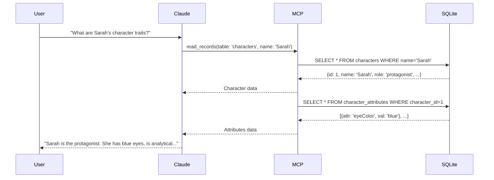

# MCP Servers for Novel Writing

This directory contains the MCP (Model Context Protocol) server configuration for the Novel Writer extension.

## What is MCP?

Model Context Protocol (MCP) is an open protocol developed by Anthropic that enables AI assistants to interact with external tools and data sources. In this extension, MCP allows Claude to:

- Query the novel's SQLite database
- Retrieve character information
- Access plot threads and timeline events
- Check for consistency issues
- Assemble context for writing assistance
- **Sync YAML files to database**
- **Create new novel elements (characters, locations, world rules, plot threads)**
- **Run consistency checks**
- **Get project health and statistics**

## Two-Server Architecture

This extension uses **two complementary MCP servers**:

### 1. **mcp-sqlite** (Database Access)
- **Purpose**: Low-level database CRUD operations
- **Package**: `mcp-sqlite` by jparkerweb
- **Version**: ^1.0.7
- **Repository**: https://github.com/jparkerweb/mcp-sqlite
- **License**: MIT
- **Provides**: Direct SQLite database queries, reads, writes

### 2. **novel-tools** (Novel Operations)
- **Purpose**: High-level novel-writing operations
- **Package**: Custom MCP server (this project)
- **Location**: `./novel-tools/`
- **Provides**: Sync, build, context assembly, consistency checking

## Available Tools

### From mcp-sqlite (Database Access)

#### Database Information
- **db_info** - Get database metadata (version, size, tables)
- **list_tables** - List all tables in the database
- **get_table_schema** - View schema for a specific table

#### CRUD Operations
- **create_record** - Insert records with object syntax
- **read_records** - Query records with conditions and pagination
- **update_records** - Update records matching conditions
- **delete_records** - Delete records matching conditions

#### Raw SQL
- **query** - Execute custom SQL queries (SELECT, INSERT, UPDATE, DELETE)

### From novel-tools (Novel Operations)

#### Sync Operations
- **sync_world_rules** - Sync world rule YAML files to database
- **sync_characters** - Sync character YAML files to database
- **sync_locations** - Sync location YAML files to database
- **sync_plot_threads** - Sync plot thread YAML files to database
- **sync_chapters** - Sync chapter markdown files to database

#### Builder Operations
- **create_world_rule** - Create new world rule with validation
- **create_character** - Create new character profile
- **create_location** - Create new location
- **create_plot_thread** - Create new plot thread

#### Context Assembly
- **get_scene_context** - Get all context needed for writing a scene
- **get_character_context** - Get comprehensive character information
- **get_location_context** - Get location details and history

#### Consistency Checking
- **check_consistency** - Run consistency checks on project
- **check_world_rules** - Validate text against world rules

#### Project Health & Stats
- **get_project_health** - Get project health dashboard
- **get_writing_stats** - Get writing statistics and streaks
- **get_plot_thread_status** - Get status of plot threads

#### Search & Query
- **search_world_rules** - Search world rules by keyword/category
- **search_characters** - Search characters by name/role

## Configuration

Both MCP servers are configured in `package.json` under the `claudeCode.extension.mcpServers` section:

```json
{
  "novel-db": {
    "description": "SQLite database for novel metadata, characters, and consistency tracking",
    "command": "npx",
    "args": [
      "-y",
      "mcp-sqlite",
      "--db-path",
      "${workspaceFolder}/.novel/novel.db"
    ],
    "autoStart": true,
    "env": {
      "NODE_ENV": "production"
    }
  },
  "novel-tools": {
    "description": "High-level novel-writing operations (sync, build, context, check)",
    "command": "node",
    "args": [
      "${workspaceFolder}/claudenovel_plugin/mcp-server/novel-tools/dist/index.js"
    ],
    "autoStart": true,
    "env": {
      "NODE_ENV": "production"
    }
  }
}
```

### Configuration Explained

#### novel-db Server (mcp-sqlite)
- **command**: `npx` - Uses npx to run the package
- **args**:
  - `-y` - Auto-confirm npx installation if needed
  - `mcp-sqlite` - The package to run
  - `--db-path` - Flag for database path
  - `${workspaceFolder}/.novel/novel.db` - Database path (substituted by Claude Code)
- **autoStart**: `true` - Start server automatically when extension loads

#### novel-tools Server
- **command**: `node` - Run directly with Node.js
- **args**:
  - Path to built server: `${workspaceFolder}/claudenovel_plugin/mcp-server/novel-tools/dist/index.js`
- **autoStart**: `true` - Start server automatically when extension loads

## Database Path

The database is located at:
```
<novel-project>/.novel/data.db
```

Example:
```
my-space-opera/
├── .novel/
│   └── data.db          ← MCP server connects here
├── characters/
├── chapters/
└── ...
```

The `${workspaceFolder}` placeholder is automatically replaced with the actual project path by Claude Code.

## How It Works

### 1. Extension Initialization

When the Novel Writer extension loads:

```typescript
// Extension detects novel project
// Claude Code reads package.json mcpServers config
// Spawns MCP server: npx -y mcp-sqlite /path/to/.novel/data.db
// Server starts and waits for tool calls
```

### 2. AI Interaction

When Claude needs data from the novel database:

```typescript
// Claude calls MCP tool
await mcpClient.read_records({
  table: 'characters',
  conditions: { role: 'protagonist' }
});

// MCP server queries SQLite database
// Returns results to Claude
// Claude uses data to generate response
```

### 3. Example Query Flow



## Manual Testing

You can test the MCP server manually:

### 1. Install Dependencies

```bash
cd claudenovel_plugin
npm install
```

### 2. Start Server

```bash
# Using npx directly
npx mcp-sqlite /path/to/project/.novel/data.db

# Or using the launcher script
node mcp-server/launch.js /path/to/project/.novel/data.db
```

### 3. Test with Claude Code

1. Open a novel project in Claude Code
2. The server should auto-start (check logs)
3. Ask Claude: "What characters are in my database?"
4. Claude should query via MCP and respond with character list

## Troubleshooting

### Server Won't Start

**Problem**: MCP server fails to start

**Solutions**:
1. Check that database file exists: `.novel/data.db`
2. Verify Node.js version: `node --version` (requires >=18.0.0)
3. Check npx is available: `npx --version`
4. Try manual start: `npx mcp-sqlite .novel/data.db`

### Database Locked

**Problem**: `SQLITE_BUSY` or `database is locked` errors

**Solutions**:
1. Close other programs accessing the database
2. Check no other MCP server instances running
3. Restart Claude Code
4. If persistent, delete `.novel/data.db-journal` file

### No Data Returned

**Problem**: Claude says "I don't see any characters" but files exist

**Solutions**:
1. Run file sync: `novel sync`
2. Check files are in correct format (YAML for characters/locations)
3. Verify database has data: `sqlite3 .novel/data.db "SELECT * FROM characters;"`
4. Check MCP server logs for errors

### npx Permission Denied

**Problem**: `EACCES` or permission errors with npx

**Solutions**:
1. Check npm global directory permissions
2. Run: `npm config get prefix` and ensure you own that directory
3. Or use: `sudo npx` (not recommended)
4. Better: fix npm permissions globally

## Development

### Adding New MCP Tools

To add custom tools:

1. **Option A**: Request tools from jparkerweb/mcp-sqlite repository
2. **Option B**: Fork mcp-sqlite and add custom tools
3. **Option C**: Create second MCP server for custom tools

Example second server config:
```json
{
  "novel-custom": {
    "command": "node",
    "args": ["./mcp-server/custom-tools.js"],
    "autoStart": true
  }
}
```

### Debugging MCP Server

Enable debug logging:

```bash
# Set environment variable
NODE_DEBUG=mcp npx mcp-sqlite .novel/data.db

# Or in package.json
{
  "env": {
    "NODE_ENV": "development",
    "NODE_DEBUG": "mcp"
  }
}
```

### Alternative MCP Servers

If you need different functionality, alternatives include:

- **Official Python server**: `uvx mcp-server-sqlite` (requires Python)
- **Custom Node.js server**: Build your own using `@modelcontextprotocol/sdk`

## Security Considerations

### Database Access

The MCP server has **full access** to the SQLite database. This means:

- ✅ Read all tables and data
- ✅ Insert/update/delete records
- ✅ Execute arbitrary SQL

**Implications**:
- Claude can help manage your novel data
- BUT be careful with destructive operations
- Always keep backups of `.novel/data.db`

### SQL Injection

The `mcp-sqlite` package uses parameterized queries internally, which prevents SQL injection:

```javascript
// Safe - uses parameters
read_records({ table: 'characters', conditions: { name: userInput } })

// Also safe - mcp-sqlite sanitizes
query({ sql: 'SELECT * FROM characters WHERE name = ?', params: [userInput] })
```

### Network Exposure

The MCP server:
- ❌ Does NOT expose a network port
- ✅ Communicates via stdio (standard input/output)
- ✅ Only accessible to Claude Code process
- ✅ Cannot be accessed remotely

## Performance

### Query Performance

- Database is local SQLite (very fast)
- Typical query: <10ms
- Context assembly: ~50ms
- Consistency check: ~200ms

### Server Overhead

- Memory: ~50MB
- CPU: Minimal (idle until called)
- Startup: ~500ms

### Optimization Tips

1. **Index Critical Columns**: Already done in schema.sql
2. **Limit Result Rows**: Use pagination in read_records
3. **Cache Repeated Queries**: Extension caches common queries
4. **Batch Operations**: Use transactions for multiple writes

## Example MCP Tool Calls

### List All Characters

```typescript
// Claude uses this tool
await mcpClient.read_records({
  table: 'characters',
  order_by: 'name'
});

// Returns:
[
  { id: 1, name: 'Sarah Chen', role: 'protagonist', ... },
  { id: 2, name: 'Marcus Blake', role: 'antagonist', ... },
  ...
]
```

### Find Character by Name

```typescript
await mcpClient.read_records({
  table: 'characters',
  conditions: { name: 'Sarah Chen' }
});
```

### Get Character with Attributes

```typescript
// First get character
const char = await mcpClient.read_records({
  table: 'characters',
  conditions: { name: 'Sarah Chen' }
});

// Then get attributes
const attrs = await mcpClient.read_records({
  table: 'character_attributes',
  conditions: { character_id: char[0].id }
});
```

### Check Consistency Issues

```typescript
await mcpClient.query({
  sql: `
    SELECT * FROM consistency_issues
    WHERE severity IN ('error', 'warning')
    AND status = 'open'
    ORDER BY severity DESC, created_at DESC
  `
});
```

### Complex Join Query

```typescript
await mcpClient.query({
  sql: `
    SELECT c.name, l.name as location, s.title as scene
    FROM character_appearances ca
    JOIN characters c ON ca.character_id = c.id
    JOIN scenes s ON ca.scene_id = s.id
    JOIN locations l ON s.location_id = l.id
    WHERE c.name = ?
    ORDER BY s.sequence_order
  `,
  params: ['Sarah Chen']
});
```

## Resources

- **MCP Protocol**: https://modelcontextprotocol.io
- **mcp-sqlite Package**: https://github.com/jparkerweb/mcp-sqlite
- **MCP SDK**: https://github.com/anthropics/mcp-typescript-sdk
- **SQLite**: https://www.sqlite.org/docs.html

## Support

For issues with:

- **MCP server itself**: https://github.com/jparkerweb/mcp-sqlite/issues
- **Novel Writer extension**: https://github.com/[your-repo]/issues
- **MCP protocol**: https://github.com/anthropics/mcp-typescript-sdk/issues

---

**Note**: The MCP server is automatically managed by the Claude Code extension. Most users won't need to interact with it directly.
